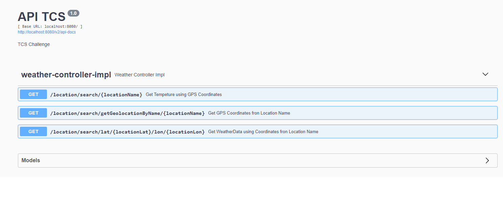

# Project TCS Challenge

## Original Idea

Build a maven application using the latest spring boot version based on Java 8.
The project should build a WAR file to be deployed in a Tomcat server version 9.*
The app will be an API which will receive a request with the name of a city as a parameter and you will have to return the temperature of this city in celsius and farenheits.

Constraints:

The API that should be used to get the weather data is: https://www.metaweather.com/api/location/search/?query=${city}
This API returns the WOEID of the city, use that information to search the temperatures.

This API returns the weather based on WOEID parameter.

https://www.metaweather.com/api/location/${woeid}/

In case there is more than one value returned please consider the most recent one.
In case we have more then one city in the returned list, get the first one.
More info about these services can be found on:
https://www.metaweather.com/api/

1 - Define the request of the service (explaining why you choose the approach)
2 - Define the response of the service (explaining why you choose the approach)
3 - Explain how to run the app.
4 - Commit your code on a git repository using your personal account and share with us a link to the repository with the details to have access to the code.
5 - Do not forget to add some tests. It is very important to us.
6 - Documentation. The API must describe itself. Generating an automatically documentation is a good way.

Do not worry if you don't know all the steps above.
We are looking for curious developers.
Thanks for your interest in the position and I hope to talk to you soon.

## The Problem

The problem was that the indicated endpoint is not available, so i tried to replicate the objective of the problem by consuming a different API which delivers weather information.
It is understood that from the original exercise you try to obtain a code from API, and then call the API that delivers the weather information through the obtained code. 
As a replacement for the endpoint that arises in the problem, the endpoint http://api.openweathermap.org will be used for the challenge to obtain information regarding the weather and taking into account "We are looking for curious developers."  I decided to explore the Spring-boot-Webflux for asynchronous consumption of the consumed methods.

## Table of Contents
* [General Info](#general-information)
* [Technologies Used](#technologies-used)
* [Features](#features)
* [Screenshots](#screenshots)
* [Setup](#setup)
* [Usage](#usage)
* [Pending for Improvement](#Pending-for-Improvement)
* [Contact](#contact)

## General Information
Sprinb-boot Reactive Rest API

## Technologies Used
- Spring-boot - version 2.5.2
- Swagger - version 3.0
- Spring-Webflux - version 2.5.2
- Lombok - version 1.18.4
- JDK 11

## Features
- Get WeatherData using Coordinates fron Location Name
- Get Tempeture using GPS Coordinates
- Get GPS Coordinates fron Location Name

## Screenshots

## Setup
- Install JDK 11
- Download de code from the repository
- Go to the clone location directoy
- Replace the "API_WEATHER_KEY" with the key provided by email
- mvn clean install -Dapi-weather.key="API_WEATHER_KEY"
- run: java -Dapi-weather.key="API_WEATHER_KEY" -jar target/spring-boot-rest-tcs-challenge.war

## Usage

- http://localhost:8080/swagger-ui/
- Using the postman colecction
- direct from the routes

## Pending for Improvement

- Set controller interface messages as properties
- Implement Security

## Contact
Created by francisco.graf@gmail.com
